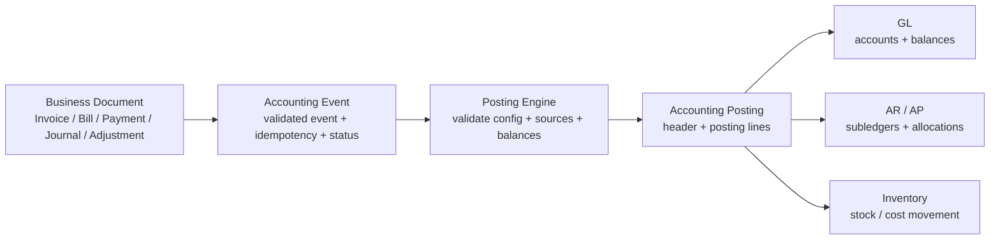

# Accounting Engine Architecture

## Mission

This application must treat accounting as a single, authoritative flow:

Business Document
→ Accounting Event
→ Posting Engine
→ Accounting Posting
→ GL / AR / AP / Inventory

The posting engine is the only place allowed to create financial state changes. Existing operational tables remain as source documents and compatibility views, but they are never the accounting source of truth.

---

## 1. Authoritative accounting lifecycle

### Canonical flow

### Rule

- Business documents are preserved as operational records.
- Accounting events are the persisted record of what happened in the business domain.
- The posting engine creates accounting postings atomically.
- GL, AR, AP, and inventory are derived from postings and subledger allocations.
- The UI must not implement accounting logic directly.

---

## 2. Model boundaries

### 2.1 Business Document

A business document is the operational source record created by the business process.

Examples:
- invoice
- invoice_line
- bill
- bill_line
- payments_received
- payments_made
- supplier_credit
- credit_note
- expense
- manual_journal
- bank_transaction
- inventory_adjustment
- inventory_receipt
- inventory_issue
- production_order
- purchase_receipt
- sales_order fulfilment events

Business documents continue to exist for workflow and reporting, but they are not the accounting ledger.

### 2.2 Accounting Event

An accounting event represents a business occurrence that has accounting impact.

Required fields:
- tenant_id
- source_document_type
- source_document_id
- event_type
- event_date
- currency
- status
- idempotency_key
- created_by
- created_at
- metadata

Examples:
- invoice_posted
- bill_posted
- customer_payment_posted
- supplier_payment_posted
- credit_note_posted
- supplier_credit_posted
- expense_posted
- manual_journal_posted
- bank_transaction_posted
- inventory_adjustment_posted
- inventory_receipt_posted
- inventory_issue_posted
- sales_order_fulfillment_posted
- purchase_receipt_posted
- production_consumption_posted
- production_completion_posted
- reversal_posted
- void_posted

Every event must be immutable once posted. A reversal creates a new event, not an edit to the original.

### 2.3 Accounting Posting

A posting is the authoritative accounting representation of one event.

Required fields:
- tenant_id
- event_id
- posting_type
- posting_date
- currency
- status
- source_reference
- reversal_of_posting_id
- created_by
- created_at

Each posting contains posting lines with debits/credits and account references.

### 2.4 Accounting Posting Line

Required fields:
- tenant_id
- posting_id
- account_id
- account_type
- direction
- amount
- currency
- source_line_id
- description

Invariants:
- sum(debits) = sum(credits)
- account must be active
- account must be allowed for this posting purpose
- date must be valid and within an open period

### 2.5 Subledger Allocation

AR/AP subledger records are separate from the GL posting itself.

Examples:
- AR invoice balance
- AR credit note allocation
- AR customer payment allocation
- AP bill balance
- AP supplier credit allocation
- AP supplier payment allocation

These allocations are created in the same transaction as the posting where appropriate.

---

## 3. Authoritative posting engine

The posting engine is the single system responsible for creating financial state.

### Engine responsibilities

1. Validate source document
   - tenant matches
   - status is valid for posting
   - amount/currency/date are valid
   - no duplicate posted event

2. Validate accounting configuration
   - all required account mappings exist
   - account type matches posting purpose
   - active accounts only
   - bank/cash accounts are not silently defaulted when a user selected a specific account

3. Calculate debit and credit lines
   - based on posting policy for invoice, bill, payment, credit note, expense, inventory movement, etc.
   - ensure currency rules are respected

4. Validate balancing
   - debits must equal credits
   - partial payments are valid if supported by allocation logic

5. Create accounting document
   - create the posting header
   - create posting lines
   - create event linkage

6. Update AR/AP subledger where applicable
   - open balance
   - invoice outstanding
   - payment allocation
   - credit balance
   - unapplied cash

7. Update inventory where applicable
   - stock movement
   - inventory valuation movement
   - cost layer movement

8. Execute atomically
   - one transaction per posting lifecycle
   - failure rolls back the whole posting

### Required engine contract

The service layer should expose server-side functions with this pattern:

- validate_business_document_for_posting()
- create_accounting_event()
- calculate_posting_lines()
- create_accounting_posting()
- apply_ar_allocation()
- apply_ap_allocation()
- apply_inventory_posting()
- finalize_posting()
- reverse_posting()
- void_posting()
- reconcile_posting_idempotency()

These are RPC/service boundaries. Client components call the RPC layer; they do not perform direct financial writes.

---

## 4. Separation of concerns

The system must separate:

- Business Document
- Accounting Event
- Accounting Posting
- Subledger Allocation

### Design principle

A document may be created in one table, but its accounting effect must be represented through an event and a posting. The account balances are not updated directly from the document row; they are updated as part of the posting engine.

This avoids competing truth between:
- document tables
- invoice/bill/payment tables
- journal tables
- customer/supplier transaction tables

---

## 5. AR architecture

### Rule

Customer invoices and credit notes must produce AR transactions.
Customer payments must create both cash movement and AR allocations.

### Supported cases

- one payment → one invoice
- one payment → multiple invoices
- partial payment
- overpayment
- unapplied payment
- credit balance
- reversal
- void

### Allocation rules

- Allocation is created inside the same transaction as the posting, when possible.
- A payment allocation may be against invoice, credit note, or unapplied cash.
- AR balance cannot exceed allowable amount after allocation.
- Reversal creates a compensating AR transaction, not a deletion.

### Accounting effect

- AR invoice posted: Dr Accounts Receivable / Cr Revenue / Cr Tax / Cr Inventory / etc.
- AR payment posted: Dr Cash / Cr Accounts Receivable (applied), or Dr Cash / Cr Unapplied Cash if unapplied.
- Credit note: Dr Revenue / Cr Accounts Receivable or reverse invoice posting depending on the business flow.

---

## 6. AP architecture

### Rule

Supplier bills and supplier credits must produce AP transactions.
Supplier payments must support multi-bill allocation and partial settlement.

### Supported cases

- one payment → one bill
- one payment → multiple bills
- partial payment
- overpayment
- unapplied payment
- reversal
- void

### Required behavior

- payment creation and posting must be atomic as one AP settlement process
- no separate workflow where a payment is created and then later posted and allocated by unrelated logic
- AP allocations are part of the same authoritative posting action

### Accounting effect

- AP bill posted: Dr Expense / asset / inventory / Cr Accounts Payable
- AP payment posted: Dr Accounts Payable / Cr Cash
- supplier credit: Dr AP / Cr Expense or contra account depending on nature

---

## 7. Bank and cash accounting

### Rule

Payments must explicitly identify:
- Paid From Account
- Deposit To Account

The selected account must be a valid bank/cash GL account. The system may not silently substitute a default account when the user explicitly chose one.

### Required validation

- account exists
- account is active
- account type is bank or cash
- tenant matches
- account is not suppressed for manual posting
- amount and currency are compatible with the selected bank account

---

## 8. Opening balances

Opening balances cannot be treated as ad hoc table fields.

They must be represented through a proper opening-balance journal/event.

### Required model

- create an opening balance event
- create an opening balance posting
- create opening balance posting lines
- post the balances to the correct GL accounts
- keep the entry as an immutable historical opening-balance record

### Ban on silent sourcing

Do not rely only on:
- `bank_accounts.opening_balance`
- `chart_of_accounts.opening_balance`

Those values may still exist for UI convenience, but they are not the accounting source of truth.

---

## 9. Reversals and voids

### Rule

Never delete posted accounting entries as the primary accounting mechanism.

Use:

Original Posting
→ Reversal Event
→ Reversal Posting

### Pattern

- A reversal event references the original posting or event.
- The reversal produces offsetting debits/credits.
- The original remains intact for audit trail.
- Void is recorded as a separate posted reversal event with a void reason.

This preserves the audit chain and avoids destructive history.

---

## 10. Idempotency

Posting operations are idempotent.

### Rule

If the same source event is submitted twice, the engine must not create duplicate accounting postings.

### Required controls

- unique idempotency key per source document / event
- unique source_reference / external_reference
- dedupe check before creating posting
- if the posting exists, return the original posting id
- if a duplicate is attempted with a different payload, reject it as a conflict

---

## 11. Direct database writes and guardrails

### Rule

No UI or arbitrary business component may directly mutate financial tables as a normal workflow.

All financial state changes should flow through the authoritative RPC/service layer.

### Audit direct writes

Any direct `.insert()`, `.update()`, or `.delete()` against a financial table must be reviewed. In the authoritative model, the allowed usage is limited to:
- migration scripts
- system bootstrap scripts
- controlled server-side posting functions
- audit/event log writes

### Security boundary

RLS remains the security boundary. It must not be used as a replacement for business-level posting rules. The posting engine must enforce the financial invariants.

---

## 12. Accounting invariants

These are mandatory for every posting:

- debits = credits
- posting belongs to a tenant
- posted documents cannot be silently edited
- posted transactions cannot be silently deleted
- reversal references original transaction
- AR allocation cannot exceed invoice or credit amount
- AP allocation cannot exceed bill or credit amount
- currency rules are respected
- accounting dates are valid
- account types are valid
- inactive accounts cannot receive new postings
- source document and event are immutable once posted

---

## 13. Compatibility and reporting

The authoritative posting model must restore report integrity.

### Reporting sources

All existing reporting must ultimately derive from the authoritative postings instead of independent tables.

Examples:
- Trial Balance
- General Ledger
- AR Aging
- AP Aging
- customer statements
- supplier statements
- bank balances
- profit and loss
- balance sheet

### Compatibility strategy

- Keep older operational tables for business workflows.
- Keep compatibility queries only until reporting is re-pointed to postings.
- Avoid maintaining two accounting sources of truth.
- Treat legacy tables as input data, not final ledger state.

---

## 14. Workflow mapping

| Workflow | Business Document | Accounting Event | Posting | GL / AR / AP / Inventory | Reporting |
| --- | --- | --- | --- | --- | --- |
| Create/post invoice | invoice + lines | invoice_posted | invoice posting + lines | GL revenue / AR / tax | Trial Balance, AR Aging, P&L |
| Create/post bill | bill + lines | bill_posted | bill posting + lines | GL expense / AP | AP Aging, P&L |
| Customer payment | payment_received | customer_payment_posted | cash + AR allocation | Cash / AR | AR Aging, bank balance |
| Supplier payment | payment_made | supplier_payment_posted | cash + AP allocation | Cash / AP | AP Aging, bank balance |
| Partial payment | payment_received | customer_payment_posted | partial allocation | Cash / AR | AR Aging, statement |
| Credit note | credit_note | credit_note_posted | reversal/credit posting | AR / revenue / tax | AR Aging, statement |
| Supplier credit | supplier_credit | supplier_credit_posted | AP credit posting | AP / expense | AP Aging |
| Expense | expense | expense_posted | expense posting | GL expense / AP or cash | P&L |
| Manual journal | manual_journal | manual_journal_posted | balanced journal | GL | GL, TB |
| Bank transaction | bank_transaction | bank_transaction_posted | cash posting | Bank / cash / GL | bank balance |
| Reversal | document + reversal | reversal_posted | compensating posting | GL / AR / AP | audit trail |
| Void | original doc | void_posted | reversal posting | GL / AR / AP | audit trail |
| Opening balance | opening_balance document | opening_balance_posted | opening balance journal | GL / AR / AP | TB, BS |

---

## 15. Implementation guidance for this codebase

The current repo already contains posting-oriented patterns via RPCs such as:
- `post_invoice`
- `post_bill`
- `post_credit_note`
- `post_payment_received`
- `post_payment_made`
- `post_bank_transaction`
- `post_expense`
- `post_adjustment`
- `post_purchase_receipt`
- `post_production_order`

This is the correct direction. The important change is to formalize them as one authoritative accounting layer, instead of mixing them with direct document-level UI logic or multiple competing ledgers.

### Architectural intent for this repo

- Keep the document tables for operational workflow.
- Use a canonical event model for any posting-ready business event.
- Use one posting engine to create journal entries, AR/AP subledger activity, and inventory effects.
- Keep compatibility reports reading from the posting layer, not from scattered transaction tables.

---

## 16. Final policy

No future UI feature should create accounting state by directly mutating the financial tables. All accounting-related state changes must route through the server-side authoritative framework:

Business Document
→ Event creation
→ Posting Engine validation and posting
→ Allocation and inventory updates
→ Reporting from postings

This is the only acceptable accounting architecture for the application.
